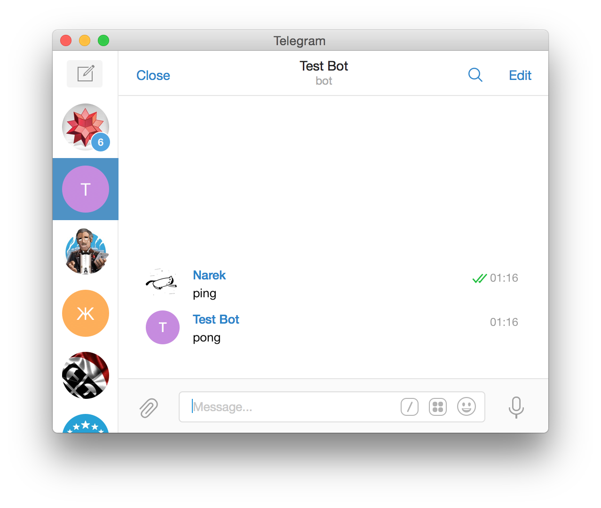

# telegram-node-bot
Very powerful module for creating Telegram bots.

[Full API reference](http://nabovyan.xyz/telegram-node-bot/)

## Installation

To install the stable version:

```bash
npm install --save telegram-node-bot
```

This assumes you are using [npm](https://www.npmjs.com/) as your package manager.
If you don’t, you can access these files on [npmcdn](https://npmcdn.com/telegram-node-bot/), download them, or point your package manager to them.

## Whats new in 3.0?

* rewritten from scratch
* native telegram models (generated from documentation)
* sessions
* logging (you can even use your logger)
* better inline mode support
* full API support
* Promises
* Much safer code, safer working with network
* better router
* support for external scope extensions
* controllers are classes now
* middleware
* and more!

## Get started

First of all you need to create your bot and get Token, you can do it right in telegram, just write to @BotFather.

Now let's write simple bot!

```js
'use strict'

const Telegram = require('telegram-node-bot')
const TelegramBaseController = Telegram.TelegramBaseController
const tg = new Telegram.Telegram('YOUR_TOKEN')

class PingController extends TelegramBaseController {
    /**
     * @param {Scope} $
     */
    pingHandler($) {
        $.sendMessage('pong')
    }

    get routes() {
        return {
            'ping': 'pingHandler'
        }
    }
}

tg.router
    .when(['ping'], new PingController())
```
That's it!



## Introduction

I'm using something like MVC, so we have router and controllers.
First you need to declare your commands and which controller will handle it.
Then you need to write controllers and handle specific commands in it.

## Router
Lets say our bot has three commands: /start, /stop and /restart
And we want that commands to be handled by different controllers.

Router declaration code will be like this:

```js
tg.router
    .when('/start', new StartController())
    .when('/stop', new StopController())
    .when('/restart', new RestartController())
```

Probably we will have a case when user send us command we didn't know, for that case router have `otherwise` function:

```js
tg.router
    .when('/start', new StartController())
    .when('/stop', new StopController())
    .when('/restart', new RestartController())
    .otherwise(new OtherwiseController())
```
Now all unknown commands will be handled by OtherwiseController:

```js
class OtherwiseController extends TelegramBaseController {
    handle() {
        console.log('otherwise')
    }
}
```

Router also has `any` method, controller passed to that method will be called for all messages.

Sometimes your commands may have some args, you can declare them like this:

```js
tg.router
    .when('/sum :num1 :num2', new SumController())
```
After that they will be in `query` property of scope:

```js
/**
 * @param {Scope} $
 */
sum($) {
    $.sendMessage(parseInt($.query.num1) + parseInt($.query.num2))
}
```

You can also pass `RegExp` as a command, all values fetched by RegExp will be in `query`.

You can define controller for inline queries using `inlineQuery` method:

```js
tg.router
    .inlineQuery(new InlineModeController())
```

And controllers for callback queries using `callbackQuery`:

```js
tg.router
    .callbackQuery(new CallbackQueryController())
```

## Controllers
 
There are three types of controllers:

* Controller for messages - `TelegramBaseController`
* Controller for CallbackQueries - `TelegramBaseCallbackQueryController`
* Controller for InlineQueries - `TelegramBaseInlineQueryController`


## TelegramBaseController

To create controller for message updates you must extend `TelegramBaseController`.

If you want specific methods of your controller be called for specific commands, you should return a plain object in `routes` property where key is a route and value is name of your method.
In that case `handle` method will not be called and scope will be passed to your method.
Example:

```js
class TestController extends TelegramBaseController {
    get routes() {
        return {
            'test': 'testHandler'
        }
    }
}
```

If there are no routes defined then `handle` method of your controller will be called.

There is also `before` method, this method will be called after all updates and you should return the scope, you can modify scope if you want:

```js
class TestController extends TelegramBaseController {
    before(command, scope) {
        scope.someData = true

        return scope
    }
}
```
Remember: if you want to handle command in controller you need to declare it in router.

All instances of TelegramBaseController also have private `_api` property which is a reference to `TelegramApi` and private `_localization` property which is a reference to `Ivan`

## TelegramBaseCallbackQueryController

To create such controller you must extend TelegramBaseCallbackQueryController.

This controllers are very simple, they have only one method - `handle`, this method will be called for all queries and instance of `CallbackQuery` will be passed.

## TelegramBaseInlineQueryController

To create such controller you must extend TelegramBaseInlineQueryController.

These controllers also have `handle` method which will be called for all queries and an instance of `InlineScope` will be passed.
Also they its have `chosenResult` method which will be called when user select some result, an instance of `ChosenInlineResult`

Also as the `TelegramBaseController` it has `_api` and `_localization` properties.


## API
You can call api methods two ways:

Directly from tg:

```js
tg.api.sendMessage(chatId, 'Hi')
```

Or if you using controllers controller will pass you context `$` that already knows current chat id, so it's more easy to use:

```js
$.sendMessage('Hi')
```

All methods have required parameters and optional parameters, you can find them in  [api documentation](https://core.telegram.org/bots/api#available-methods)
If you want to pass optional parameters you should pass them as an object:
```js
$.sendMessage('Hi', { disable_notification: true })
```

## Scope

There is two types of scope:

* scope for message controllers - `Scope`
* scope for inline mode controller - `InlineScope`

Message controllers scope:

scope will be passed to `handle` method or to your methods defined in `routes`

Main feature of scope is that scope already knows current chat id, so there is no need to pass that parameter.
Scope have all api methods that have chatId as their first parameter already filled.

Scope also contains some information about update.


Inline controllers scope also has all api methods filled with userId.

## Forms

In message controllers scope has `runForm` method.

With `$.runForm` method you can create forms:

```js
const form = {
    name: {
	    q: 'Send me your name',
	    error: 'sorry, wrong input',
	    validator: (message, callback) => {
		    if(message.text) {
			    callback(true, message.text) //you must pass the result also
			    return
		    }

		    callback(false)
	    }
    },
    age: {
	    q: 'Send me your age',
	    error: 'sorry, wrong input',
	    validator: (message, callback) => {
		    if(message.text && IsNumeric(message.text)) {
			    callback(true, toInt(message.text))
			    return
		    }

		    callback(false)
	    }
    }
}

$.runForm(form, (result) => {
	console.log(result)
})
```

Bot will send the 'q' message to user, wait for message, validate it with your validator function and save the answer, if validation fails bot will ask again that question.
You can also do some filtering in your validator, so you can pass the result as second parameter to callback.
You can also pass keyboard to `keyboard` field.

## Menu

You can create menu with $.runMenu function:

```js
$.runMenu({
    message: 'Select:',
    options: {
        parse_mode: 'Markdown' // in options field you can pass some additional data, like parse_mode
    },
    'Exit': {
	    message: 'Do you realy want to exit?',
	    resizeKeyboard: true,
	    'yes': () => {

	    },
	    'no': () => {

	    }
    },
    'anyMatch': () => { //will be executed at any other message

    }
})
```

Bot will create keyboard and send it with your message, when user tap button bot will call its callback, if it's submenu bot will send submenu.

Layouting menu:

You can pass the maximum number of buttons in line like this:

```js
$.runMenu({
    message: 'Select:',
    layout: 2,
    'test1': () => {}, //will be on first line
    'test2': () => {}, //will be on first line
    'test3': () => {}, //will be on second line
    'test4': () => {}, //will be on second line
    'test5': () => {}, //will be on third line
})
```
Or you can pass an array of number of buttons for each line:

```js
$.runMenu({
    message: 'Select:',
    layout: [1, 2, 1, 1],
    'test1': () => {}, //will be on first line
    'test2': () => {}, //will be on second line
    'test3': () => {}, //will be on second line
    'test4': () => {}, //will be on third line
    'test5': () => {}, //will be on fourth line
})
```

## Inline Menu

You can create inline menu using $.runInlineMenu:

```js
$.runInlineMenu({
    layout: 2, //some layouting here
    method: 'sendMessage', //here you must pass the method name
    params: ['text'], //here you must pass the parameters for that method
    menu: [
        {
            text: '1', //text of the button
            callback: (callbackQuery, message) => { //to your callback will be passed callbackQuery and response from method
                console.log(1)
            }
        },
        {
            text: 'Exit',
            message: 'Are you sure?',
            layout: 2,
            menu: [ //Sub menu (current message will be edited)
                {
                    text: 'Yes!',
                    callback: () => {

                    }
                },
                {
                    text: 'No!',
                    callback: () => {

                    }
                }
            ]
        }
    ]
})
```

## waitForRequest

Messages controller scope has `waitForRequest` method after calling that the next update from current user will be passed to promise.

## waitForCallbackQuery

If you send some inline keyboard after that you can call this method, pass to it string or array of string with callback data or your InlineKeyboardMarkup and then when user press button CallbackQuery will be passed to Promise


## Sessions

Message controllers scope has two properties for sessions:

* current chat session - $.chatSession
* current user session - $.userSession

Sessions work like plain objects:

```js
$.userSession.name = 'Bill'

$.console.log($.userSession.name)
```

By default sessions are stored in memory, but you can store them anywhere, you need to extend `BaseStorage` and pass instance of your storage to `Telegram`:

```js
const tg = new Telegram.Telegram('YOUR_TOKEN', null, new MyStorage())
```

## Logging

Module makes some logs during work, by default logs are written to console, but you can create your own logger if you want, you must extend `BaseLogger` and pass instance of your logger to `Telegram`:

```js
const tg = new Telegram.Telegram('YOUR_TOKEN', new MyLogger())
```

## Localization

To use localization you need to pass your localization files to `Telegram`, they must be like this:

```js
{
  "lang": "Ru",
  "phrases": {
    "startMessage": "тест"
  }
}
```

after creating your files you need to pass them to `Telegram`:

```js
const tg = new Telegram.Telegram('YOUR_TOKEN', null, null, [ require('./Ru.json') ])
```

Now you can use them in controllers like this:
```js
console.log(this._localization.Ru.startMessage)
```

You can even set the language for specific user:
```js
this._localization.setLanguageForUser(123456, 'Ru')
```

Or get phrases for user:
```js
this._localization.forUser(123456)
```

## Scope extensions:

Lets say you have some function that you want to be in scope, now you can do that like this:


```js
'use strict'

const Telegram = require('telegram-node-bot')
const TelegramBaseController = Telegram.TelegramBaseController
const BaseScopeExtension = Telegram.BaseScopeExtension
const tg = new Telegram.Telegram('YOUR_TOKEN')

class SumScopeExtension extends BaseScopeExtension {
    process(num1, num2) {
        return num1 + num2
    }

    get name() {
        return 'sum'
    }
}

class SumController extends TelegramBaseController {
    /**
     * @param {Scope} $
     */
    sumHandler($) {
        $.sendMessage($.sum($.query.num1, $.query.num2))
    }

    get routes() {
        return {
            '/sum :num1 :num2': 'sumHandler'
        }
    }
}

tg.router
    .when(['/sum :num1 :num2'], new SumController())

tg.addScopeExtension(SumScopeExtension)
```

## Sending files

From file id:

```js
$.sendPhoto(InputFile.byId('ID')) or $.sendPhoto('ID')
```

From url:

```js
$.sendPhoto(InputFile.byUrl('URL', 'image.jpg')) or $.sendPhoto({ url: 'URL', filename: 'image.jpg'})
```

By path:

```js
$.sendPhoto(InputFile.byFilePath('path/to/file')) or $.sendPhoto({ path: 'path/to/file'})
```

[Full API reference](http://nabovyan.xyz/telegram-node-bot/)

## License

Copyright (c) 2016 Narek Abovyan

Permission is hereby granted, free of charge, to any person obtaining a copy of this software and associated documentation files (the "Software"), to deal in the Software without restriction, including without limitation the rights to use, copy, modify, merge, publish, distribute, sublicense, and/or sell copies of the Software, and to permit persons to whom the Software is furnished to do so, subject to the following conditions:

The above copyright notice and this permission notice shall be included in all copies or substantial portions of the Software.

THE SOFTWARE IS PROVIDED "AS IS", WITHOUT WARRANTY OF ANY KIND, EXPRESS OR IMPLIED, INCLUDING BUT NOT LIMITED TO THE WARRANTIES OF MERCHANTABILITY, FITNESS FOR A PARTICULAR PURPOSE AND NONINFRINGEMENT. IN NO EVENT SHALL THE AUTHORS OR COPYRIGHT HOLDERS BE LIABLE FOR ANY CLAIM, DAMAGES OR OTHER LIABILITY, WHETHER IN AN ACTION OF CONTRACT, TORT OR OTHERWISE, ARISING FROM, OUT OF OR IN CONNECTION WITH THE SOFTWARE OR THE USE OR OTHER DEALINGS IN THE SOFTWARE.
